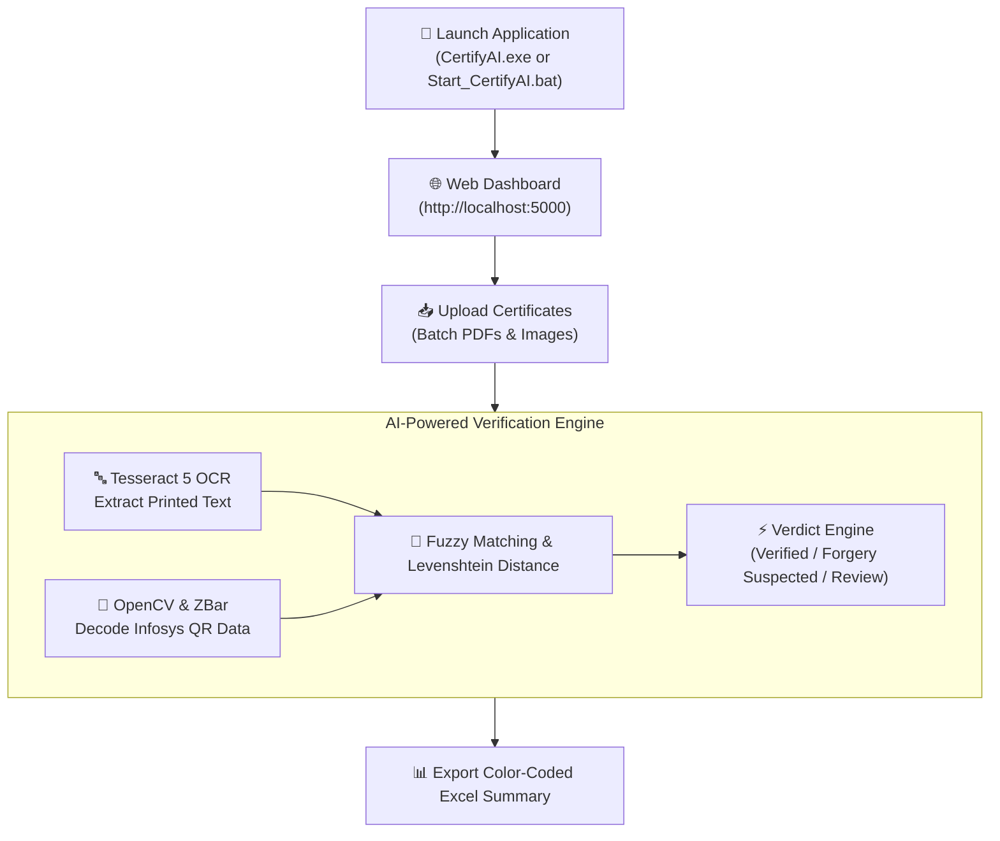

# 🛡️ CertifyAI (v3.0.0-desktop)

### AI-Powered Infosys Certificate Verification System for Faculties

**Detect fake certificates in seconds, not hours.**

---

**Upload Certificates → AI OCR & QR Data Extraction → Cross-Verification → Forgery Detection → Color-Coded Excel Report**

*Specifically engineered for educational institutions, faculty coordinators, and HR departments verifying Infosys and technical training certificates at scale.*

---

## 📦 Latest Release: v3.0.0 Universal Executable

The latest **v3.0.0-desktop** release bundles the entire CertifyAI system into a **single, zero-dependency Windows binary (`CertifyAI.exe`)**.

### What's New in v3.0.0
* **Standalone Executable (`dist/CertifyAI.exe`)**: Zero manual setup required. Bundles the complete Python 3.11 runtime, FastAPI server, UI assets, and OCR tools into a portable ~230MB binary.
* **Real-Time Operational Console**: Displays an attached terminal window for live progress logging, server diagnostic output, and verification telemetry.
* **Single Instance Guard**: Uses OS-level process mutex locks to prevent duplicate application instances and port conflicts.
* **Automatic System Browser Launch**: Automatically opens your default web browser to `http://localhost:5000` upon initialization.
* **Clean Session Shutdown**: Includes a UI control to terminate background processes cleanly.

👉 **[Download CertifyAI.exe (v3.0.0-desktop Release)](https://github.com/VishalRaut2106/Certify_ai/releases/tag/v3.0.0-desktop)**

---

## ⚡ Quick Start Options

### Option 1: Standalone EXE (Recommended for End-Users)
1. Download `CertifyAI.exe` from the [v3.0.0-desktop Release Page](https://github.com/VishalRaut2106/Certify_ai/releases/tag/v3.0.0-desktop).
2. Double-click `CertifyAI.exe`.
3. The app starts automatically and launches your web browser at `http://localhost:5000`.

### Option 2: Developer & Debug Batch Scripts

For development, debugging, or customizing the codebase, use the included build and script files:

* `setup.bat`: **One-Time Environment Setup**. Creates a Python virtual environment (`venv`), installs dependencies from `requirements.txt`, and automatically configures required Tesseract OCR and Poppler binaries.
* `Start_CertifyAI.bat`: **Debug / Development Launcher**. Starts the FastAPI backend server in live-reload mode, mounts the static frontend UI, and opens the default browser.
* `build_exe.bat`: **Standalone Binary Builder**. Invokes PyInstaller using `CertifyAI_OneFile.spec` to package the source code, dependencies, and frontend assets into the distribution file `dist/CertifyAI.exe`.
* `CertifyAI_OneFile.spec`: **PyInstaller Specification File**. Configures static asset bundling (`src/frontend`), hidden module imports (FastAPI, PyWebView, OpenCV, Tesseract), and execution parameters.

---

## 🏗️ System Architecture & Workflow

Below is the system flowchart for **CertifyAI v3.0.0**, illustrating execution paths, batch certificate processing, Infosys faculty certificate cross-validation, and report generation:

---

## 🔧 Build & Debug Files Reference

| File / Folder | Type | Purpose |
|---------------|------|---------|
| `dist/CertifyAI.exe` | Binary | Portable standalone application executable for end users. |
| `CertifyAI_OneFile.spec` | PyInstaller Spec | Configuration defining hidden imports, static asset bundling (`src/frontend`), and binary compilation settings. |
| `build_exe.bat` | Script | Automated PyInstaller packaging script that compiles `dist/CertifyAI.exe`. |
| `setup.bat` | Script | Environment bootstrapper for development. Creates `venv` and installs dependencies. |
| `Start_CertifyAI.bat` | Script | Development launcher for running the source code locally with hot reloading. |
| `src/backend/app.py` | Python | FastAPI backend handling file uploads, verification APIs, and Excel export logic. |
| `src/backend/ocr.py` | Python | Tesseract OCR integration with image sharpening and contrast optimization. |
| `src/backend/qr_decoder.py` | Python | OpenCV and ZBar QR code detection and JSON payload parsing. |
| `src/backend/comparator.py` | Python | Cross-verification engine using fuzzy matching logic to detect certificate modifications. |
| `src/frontend/` | Web | Single-page UI constructed with HTML, Vanilla CSS, and JavaScript. |

---

## 🎯 Key Features

* **AI-Powered Infosys Certificate Verification System for Faculties**: Specifically engineered for educational institutions to verify faculty certificates issued by Infosys and technical training portals.
* **Multi-Layer Fraud Detection**: Cross-references printed OCR text against decoded QR code JSON payloads to flag altered names, dates, or registration IDs.
* **Parallel Processing**: Supports batch verification of up to 100 certificates simultaneously with multi-threaded execution.
* **Color-Coded Excel Exports**: Automatically formats verification reports with visual indicators (`Verified`, `Likely Valid`, `Forgery Suspected`, `Manual Review`).
* **Zero Configuration Needed**: Run `CertifyAI.exe` directly on any machine without installing third-party runtimes or compilers.

---

## 📄 License & Support

Distributed under the MIT License. See [LICENSE](LICENSE) for details.

* **GitHub Repository**: [VishalRaut2106/Certify_ai](https://github.com/VishalRaut2106/Certify_ai)
* **Releases**: [CertifyAI GitHub Releases](https://github.com/VishalRaut2106/Certify_ai/releases)
